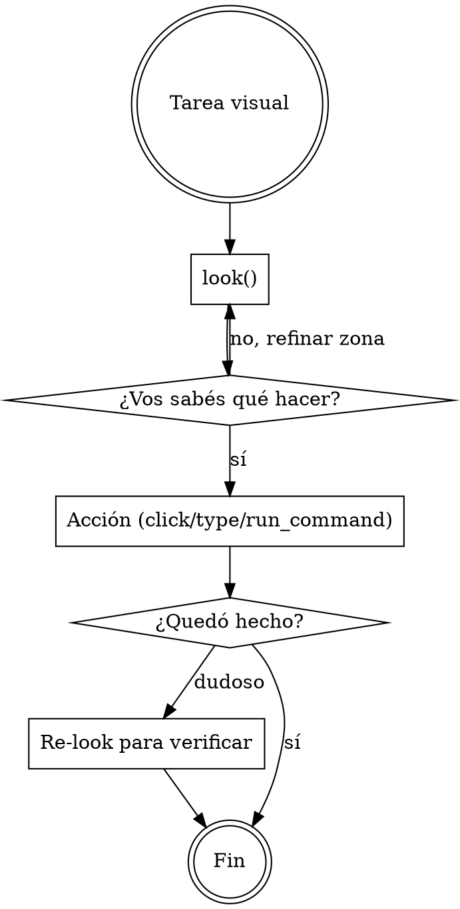

# Verdesk — control de escritorio vía MCP

**Qué es**: Verdesk es un servidor MCP local que expone la pantalla y el control del PC del user para que vos lo manejes. Está optimizado para que vos consumas pocos tokens y respondas rápido: cada captura te devuelve **solo lo que cambió desde la anterior** + texto plano leído de la zona relevante.

**Antes de actuar**: el endpoint MCP ya está registrado por el user en Claude Code. Vos consumís sus tools.

## Cuándo usar

Activá Verdesk siempre que la tarea involucre:

- **Ver qué hay en pantalla** del user (Windows, navegador, app de escritorio, juego, IDE, terminal, lo que sea).
- **Hacer click**, escribir, arrastrar, scrollear sobre la pantalla del user.
- **Leer texto plano** de una región de pantalla (sin que el user copie/pegue).
- **Lanzar un comando** en la shell del PC del user (cuando trabajas remoto y querés evitar 20 clicks).
- **Mantener memoria visual** entre turnos — qué viste en la pantalla en t-1 vs t-2.

No la uses para: editar archivos del proyecto (usá Read/Write/Edit), correr CI, buscar en código (usá Grep). Verdesk es para **lo que el user ve en su monitor**, no para el codebase.

## Workflow recomendado



**Regla 1**: empezá con `look()` — es la primitiva barata. Devuelve resumen visual + texto plano + layout. Cero pixels por default, modo `glance`.

**Regla 2**: si necesitás más detalle, `look(zone=...)` para enfocar una zona, o `refine_cell(...)` para subir calidad de una celda específica. **No re-capturás todo cada turno**.

**Regla 3**: para tomar acción usá la primitiva más alta disponible:
- Si hay tree de UI Automation (`list_uia_elements`) → `uia_action` (semántico, robusto).
- Si no, hay layout textual en `look()` → `click_text("texto visible")`.
- Último recurso: `click_at(x, y)` con coordenadas absolutas.

**Regla 4**: para texto en pantalla, leelo del campo `text` que devuelve `look()`. Te llega **plano**, listo para razonar. No tenés que procesar la imagen.

## Tools principales

### Ver pantalla
| Tool | Cuándo |
|------|--------|
| `look(zone?, mode?)` | Primitiva principal. `mode=glance` (cheap), `full` (detallado). Devuelve collages + texto + layout. |
| `capture(cells, params)` | Captura modulada por celdas (grilla 12×8). Devuelve **solo deltas** vs el buffer activo. |
| `refine_cell(cell, params)` | Re-capturar UNA celda con calidad superior (sin re-capturar todo). |
| `get_buffer_state()` | Qué hay en el buffer activo ahora — metadata, sin pixels. |

### Acción
| Tool | Cuándo |
|------|--------|
| `click_text(text, occurrence?)` | Click sobre el primer/Nth match de un substring de pantalla. |
| `click_collage(id)` | Click sobre el centro de un collage estable del último `look()`. |
| `uia_action(id, action, value?)` | Acción semántica sobre un elemento UI Automation: invoke/set_value/toggle/select. |
| `click_at(x, y)`, `send_keys(text)`, `press_key(key)` | Bajo nivel, coords absolutas + sintético. |
| `scroll(direction, amount_px, target_id?)` | Scrollear el viewport o un elemento. |
| `focus_window(hwnd_hex)` | Traer una ventana al frente antes de mandar input. |

### Historial visual (memoria entre turnos)
| Tool | Cuándo |
|------|--------|
| `list_history(filters?)` | Snapshots archivados con razón (URL changed, force, etc.). |
| `query_history(phash, threshold)` | "¿Vi esto antes?" Memoria asociativa visual cross-session. |

### Profiles de modulación
| Tool | Cuándo |
|------|--------|
| `list_profiles(filters?)` | Recetas guardadas (resolución, color mode, ajustes). |
| `load_profile(id? \| target_match?)` | Usar el mejor profile para un target específico (ej. `target_match="monitor:primary"`). |
| `save_profile(name, target, params, ...)` | Guardar tu propia receta cuando encontrás una buena combinación. |
| `rate_profile(id, rating)` | Reportar qué tan bien rindió un profile (la próxima IA lo va a preferir si rateaste alto). |

### Shell remoto
| Tool | Cuándo |
|------|--------|
| `run_command(cmd, cwd?, timeout?)` | Ejecutar un comando en el PC del user. Útil cuando vos trabajás remoto y querés evitar input synth. Devuelve stdout/stderr/exit_code. |

## Setup del user (referencia rápida)

El user instala Verdesk + registra el MCP:

```
# Skill (esto)
/plugin marketplace add https://github.com/chamilonster/verdesk-skill
/plugin install verdesk@verdesk-skill

# MCP endpoint (depende del modo de acceso elegido en Settings → 04 ACCESO):
claude mcp add verdesk http://<host>:<port>/mcp
```

Si el user te muestra un archivo `<hostname>_verdesk.md` generado por Verdesk, leelo: contiene el endpoint correcto + cualquier paso adicional (tunel SSH, token de aprobación) específico de su setup.

## Tono al responder al user

El user de Verdesk típicamente quiere que vos **hagas la tarea**, no que le expliques cómo. Cuando logres lo pedido, decí qué hiciste en una frase + el resultado. No detalles cada tool call salvo que pregunten. Verdesk te da herramientas; el user te paga por usarlas.
