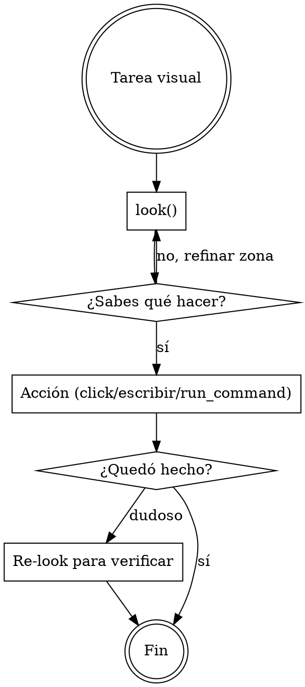

# Verdesk — control de escritorio vía MCP

**Qué es para vos**: una caja de herramientas MCP que te deja ver la pantalla del user y operar su PC. Te ahorra tokens — no te pasa screenshots completos cada turno, te pasa lo justo.

## Conexión inicial (primera vez)

Si el user te pegó un bloque que se ve así, estás ante un setup remoto y tenés que bootstrappearte:

```
name: <nombre>
host: <ip>
port: <mcp_port>
control_port: <control_port>
bootstrap_token: <token>
```

Si NO ves ese bloque (modo Local del mismo PC, o el server ya está registrado en tu cliente), saltea esta sección.

### Pasos del bootstrap

1. Si no tenés esta skill activa en tu cliente, escribí este mismo manual a `~/.claude/skills/verdesk/SKILL.md`. Próximo turno la skill queda lista.

2. Generá un keypair SSH dedicado a esta conexión (sin passphrase):
   ```
   ssh-keygen -t ed25519 -N "" -C "verdesk-<nombre>" -f ~/.ssh/verdesk_<nombre>
   ```
   Si el archivo ya existe (re-bootstrap), reusalo.

3. Autorizá tu clave pública contra el server. `POST http://<host>:<control_port>/control/authorize-key`:
   - Header: `X-Verdesk-Auth: <bootstrap_token>` y `Content-Type: application/json`
   - Body: `{"public_key": "<contenido de verdesk_<nombre>.pub>"}`
   - Mientras el call está abierto, al user le aparece un popup en su pantalla para aprobar. Esperá la respuesta sin timeout agresivo del lado tuyo — el user puede tardar minutos.
   - Respuestas:
     - `200 {"added": true, "ssh_user": "..."}` → aprobado, guardá `ssh_user`.
     - `200 {"added": false, "ssh_user": "..."}` → la clave ya estaba (idempotente). Guardá `ssh_user`.
     - `401` → token inválido. Revisar el bloque de datos.
     - `403` → user rechazó. Avisale, no reintentes.
     - `400` → la pública está en formato inválido. Regenerá el keypair.

   Algos aceptados para el keypair: `ssh-ed25519` (recomendado), `ssh-rsa`, `ecdsa-sha2-nistp{256,384,521}`, claves de seguridad físicas (`sk-*`).

4. Abrí un tunnel SSH al server. Elegí un puerto local libre `<localPort>` (puede ser el mismo `<port>` o cualquier otro alto). En background:
   ```
   ssh -i ~/.ssh/verdesk_<nombre> -L <localPort>:localhost:<port> -N <ssh_user>@<host>
   ```
   El tunnel debe quedar vivo durante toda la sesión.

5. Registrá el server MCP en tu `.mcp.json` (en el cwd del proyecto, o `~/.claude.json` si es global):
   ```json
   {
     "mcpServers": {
       "<nombre>": {
         "type": "http",
         "url": "http://127.0.0.1:<localPort>/mcp"
       }
     }
   }
   ```

6. Decile al user que cierre y reabra su cliente para que recargue los servers MCP. Cuando vuelva, el server `<nombre>` aparece conectado.

El user solo aprueba una vez. Próximas sesiones reusan la misma clave sin popup.

### Modo Local (mismo PC)

Si Verdesk corre en la misma máquina que vos, saltea todo lo anterior. El user solo necesita:
```
claude mcp add --transport http verdesk http://127.0.0.1:47802/mcp
```

## Cuándo usar Verdesk

- **Ver qué hay en pantalla** del user (cualquier app, juego, IDE, terminal, navegador).
- **Hacer click, escribir o scrollear** sobre su pantalla.
- **Leer texto plano** de una región de pantalla sin que el user copie/pegue.
- **Lanzar un comando** en su shell (cuando trabajás remoto y querés evitar 20 clicks).
- **Memoria visual** entre turnos — qué viste en t-1 vs t-2.

No la uses para: editar archivos del proyecto (`Read/Write/Edit`), correr CI, buscar en código (`Grep`). Verdesk es para **lo que el user ve en su monitor**, no para el codebase.

## Workflow



**Regla 1**: empezá con `look()` — es la primitiva barata. Devuelve resumen visual + texto plano + layout. Cero pixels por default.

**Regla 2**: si necesitás más detalle, `look(zone=...)` para enfocar una zona, o `refine_cell(...)` para una celda. **No vuelvas a capturar todo cada turno**.

**Regla 3**: para tomar acción usá la primitiva más alta disponible:
- Si hay árbol de UI Automation (`list_uia_elements`) → `act_uia` (semántico, robusto).
- Si no, layout textual en `look()` → `click_text("texto visible")`.
- Último recurso: `click_at(x, y)` con coordenadas absolutas.

**Regla 4**: para leer texto de pantalla, usá el campo `text` que devuelve `look()`. Llega plano, listo para razonar.

## Tools principales

### Ver pantalla
| Tool | Cuándo |
|------|--------|
| `look(zone?, want?, mode?)` | Primitiva principal. `mode`: `glance` (barato, default) \| `detail`. `want`: subset de `["visual","text","layout"]` (default `["text","layout"]`). |
| `capture(cells?, color_mode?, quality?, ...)` | Captura por celdas (grilla 12×8). Devuelve solo deltas. Preferí `look()` para flujos nuevos. |
| `refine_cell(cell_id, quality?)` | Re-capturar una celda con calidad superior. |
| `get_buffer_state(include_thumbnails?)` | Qué hay en el buffer ahora — metadata sin pixels. |

### Acción
| Tool | Cuándo |
|------|--------|
| `act_uia(id, action)` | Acción semántica sobre un elemento UI Automation. `action`: `{kind, value?}` — `kind`: `invoke` \| `set_value` (+`value`) \| `toggle` \| `select` \| `expand` \| `collapse`. `id` es un `auto_NNN` de `list_uia_elements`. |
| `list_uia_elements(visible_only?, max_depth?)` | Inventario del árbol UI Automation. Solo desktop. |
| `click_text(query, occurrence?)` | Click sobre un substring de pantalla. `occurrence`: `first` \| `last` \| `nth` \| `all`. |
| `click_collage(id)` | Click sobre un collage estable del último `look()`. |
| `click_at(x, y)` · `send_keys(text)` · `press_key(key, ctrl?, alt?, shift?, win?)` | Bajo nivel: coords, tipear texto, combo de teclas. |
| `scroll(direction, amount_px)` | Scroll del viewport. |
| `focus_window(hwnd_hex)` | Traer una ventana al frente antes de mandar input. |

### Memoria visual entre turnos
| Tool | Cuándo |
|------|--------|
| `list_history(reason?, url_contains?, limit?, ...)` | Snapshots archivados con su razón de reset. |
| `query_history(phash, threshold?)` | "¿Vi esto antes?" Búsqueda asociativa. |

### Profiles de modulación
| Tool | Cuándo |
|------|--------|
| `list_profiles(target_match?, min_rating?, creator_kind?)` | Recetas guardadas. |
| `load_profile(id? \| target_match?)` | El mejor profile para un target. |
| `save_profile(target_type, target_match, params, creator, ...)` | Guardar una receta cuando encuentras una buena combinación. |
| `rate_profile(id, rating?)` | Reportar qué tan bien rindió (0.0–1.0). |

### Shell del user
| Tool | Cuándo |
|------|--------|
| `run_command(command, cwd?, timeout_ms?)` | Ejecutar comando en el PC del user. Devuelve stdout/stderr/exit_code. |

## Tono con el user

El user de Verdesk quiere que **hagas la tarea**, no que le expliques cómo. Cuando logres lo pedido, decile qué hiciste en una frase + el resultado. No detalles cada tool call salvo que lo pregunten.
