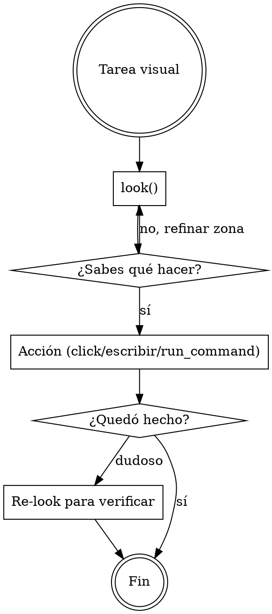

# Verdesk — control de escritorio vía MCP

**Qué es**: Verdesk es un servidor MCP local que expone la pantalla y el control del PC del user para que tú lo manejes. Está optimizado para que consumas pocos tokens y respondas rápido: cada captura devuelve **solo lo que cambió desde la anterior** + texto plano leído de la zona relevante.

**Antes de actuar**: el endpoint MCP ya está registrado por el user en Claude Code. Tú consumes sus tools.

## Cuándo usar

Activa Verdesk siempre que la tarea involucre:

- **Ver qué hay en pantalla** del user (Windows, navegador, app de escritorio, juego, IDE, terminal, lo que sea).
- **Hacer click**, escribir o scrollear sobre la pantalla del user.
- **Leer texto plano** de una región de pantalla (sin que el user copie/pegue).
- **Lanzar un comando** en la shell del PC del user (cuando trabajas remoto y quieres evitar 20 clicks).
- **Mantener memoria visual** entre turnos — qué viste en la pantalla en t-1 vs t-2.

No la uses para: editar archivos del proyecto (usa Read/Write/Edit), correr CI, buscar en código (usa Grep). Verdesk es para **lo que el user ve en su monitor**, no para el codebase.

## Workflow recomendado



**Regla 1**: empieza con `look()` — es la primitiva barata. Devuelve resumen visual + texto plano + layout. Cero pixels por default, modo `glance`.

**Regla 2**: si necesitas más detalle, `look(zone=...)` para enfocar una zona, o `refine_cell(...)` para subir calidad de una celda específica. **No vuelvas a capturar todo cada turno**.

**Regla 3**: para tomar acción usa la primitiva más alta disponible:
- Si hay árbol de UI Automation (`list_uia_elements`) → `act_uia` (semántico, robusto).
- Si no, hay layout textual en `look()` → `click_text("texto visible")`.
- Último recurso: `click_at(x, y)` con coordenadas absolutas.

**Regla 4**: para texto en pantalla, léelo del campo `text` que devuelve `look()`. Llega **plano**, listo para razonar. No tienes que procesar la imagen.

## Tools principales

### Ver pantalla
| Tool | Cuándo |
|------|--------|
| `look(zone?, want?, mode?)` | Primitiva principal. `mode`: `glance` (barato, default) \| `detail`. `want`: subset de `["visual","text","layout"]` (default `["text","layout"]`). Devuelve collages + texto + layout. |
| `capture(cells?, color_mode?, quality?, ...)` | Captura modulada por celdas (grilla 12×8). Devuelve **solo deltas** vs el buffer activo. Legacy — preferí `look()` para flujos nuevos. |
| `refine_cell(cell_id, quality?)` | Re-capturar UNA celda con calidad superior, sin re-capturar todo. |
| `get_buffer_state(include_thumbnails?)` | Qué hay en el buffer activo ahora — metadata, sin pixels por default. |

### Acción
| Tool | Cuándo |
|------|--------|
| `act_uia(id, action)` | Acción semántica sobre un elemento UI Automation. `action` es un objeto `{kind, value?}` — `kind`: `invoke` \| `set_value` (+`value`) \| `toggle` \| `select` \| `expand` \| `collapse`. `id` es un `auto_NNN` de `list_uia_elements`. |
| `list_uia_elements(visible_only?, max_depth?)` | Inventario del árbol UI Automation del target — IDs `auto_NNN`, name, control_type, patterns soportados. Solo desktop. |
| `click_text(query, occurrence?)` | Click sobre un substring de pantalla. `occurrence`: `first` (default) \| `last` \| `nth` \| `all`. |
| `click_collage(id)` | Click sobre el centro de un collage estable del último `look()`. |
| `click_at(x, y)` · `send_keys(text)` · `press_key(key, ctrl?, alt?, shift?, win?)` | Bajo nivel: click por coords, tipear texto, tecla nombrada o combo (ej. `press_key("P", ctrl=true)`). |
| `scroll(direction, amount_px)` | Scrollear el viewport. `direction`: `up` \| `down` \| `left` \| `right`. |
| `focus_window(hwnd_hex)` | Traer una ventana al frente antes de mandar input. |

### Historial visual (memoria entre turnos)
| Tool | Cuándo |
|------|--------|
| `list_history(reason?, url_contains?, limit?, ...)` | Snapshots archivados con su razón de reset. |
| `query_history(phash, threshold?)` | "¿Vi esto antes?" Memoria asociativa visual cross-session. |

### Profiles de modulación
| Tool | Cuándo |
|------|--------|
| `list_profiles(target_match?, min_rating?, creator_kind?)` | Recetas guardadas (resolución, color mode, ajustes). |
| `load_profile(id? \| target_match?)` | El mejor profile para un target (ej. `target_match="monitor:primary"`). |
| `save_profile(target_type, target_match, params, creator, ...)` | Guardar una receta cuando encuentras una buena combinación. |
| `rate_profile(id, rating?)` | Reportar qué tan bien rindió un profile (0.0–1.0; la próxima IA lo prefiere si rateaste alto). |

### Shell remoto
| Tool | Cuándo |
|------|--------|
| `run_command(command, cwd?, timeout_ms?)` | Ejecutar un comando en el PC del user. Útil cuando trabajas remoto y quieres evitar input synth. Devuelve stdout/stderr/exit_code. |

## Setup del user (referencia rápida)

El user instala Verdesk + registra el MCP:

```
# Skill (esto)
/plugin marketplace add https://github.com/chamilonster/verdesk-skill
/plugin install verdesk@verdesk-skill

# MCP endpoint (depende del modo de acceso elegido en Settings → 04 ACCESO):
claude mcp add verdesk http://<host>:<port>/mcp
```

Si el user te muestra un archivo `<hostname>_verdesk.md` generado por Verdesk, léelo: contiene el endpoint correcto + cualquier paso adicional (túnel SSH, token de aprobación) específico de su setup.

## Tono al responder al user

El user de Verdesk típicamente quiere que **hagas la tarea**, no que le expliques cómo. Cuando logres lo pedido, di qué hiciste en una frase + el resultado. No detalles cada tool call salvo que lo pregunten. Verdesk te da las herramientas; el user te paga por usarlas.
