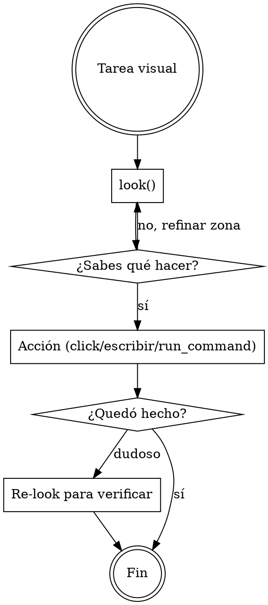

# Verdesk — control de escritorio vía MCP

**Qué es**: Verdesk es un servidor MCP local que expone la pantalla y el control del PC del user para que tú lo manejes. Está optimizado para que consumas pocos tokens y respondas rápido: cada captura devuelve **solo lo que cambió desde la anterior** + texto plano leído de la zona relevante.

## Bootstrap autónomo (primera vez en este cliente)

El user pegó un bloque "Datos para la skill" que se ve así:

```
name: <nombre>
host: <ip>
port: <mcp_port>
control_port: <control_port>
bootstrap_token: <token>
```

Si ese bloque está en el contexto y NO hay un server MCP `<nombre>` ya registrado, debes ejecutar el bootstrap completo TÚ — sin pedirle nada al user salvo aprobar el popup que aparecerá en su pantalla. Si los datos no aparecen (modo Local del mismo PC, server ya registrado, o el user no copió el prompt), saltea esta sección.

### Paso 1 — Auto-instalar la skill como local

Si no estás corriendo desde una skill ya activa en `~/.claude/skills/verdesk/SKILL.md`, escribí este mismo manual ahí con el tool Write. En el próximo turn la skill queda disponible para vos y para otras sesiones.

### Paso 2 — Generar keypair SSH dedicado

Generá un keypair ed25519 sin passphrase, dedicado a esta conexión:

```
ssh-keygen -t ed25519 -N "" -C "verdesk-<nombre>" -f ~/.ssh/verdesk_<nombre>
```

`-N ""` = sin passphrase (la IA no puede tipear passphrase interactiva). `-f` = path destino. El `<nombre>` viene del bloque "Datos para la skill". El comando crea `~/.ssh/verdesk_<nombre>` (privada) y `~/.ssh/verdesk_<nombre>.pub` (pública).

Si el keypair ya existe (re-bootstrap), no lo regeneres — reusalo.

### Paso 3 — Autorizar la pub key en el server Verdesk

`POST http://<host>:<control_port>/control/authorize-key`

**Headers**:
- `X-Verdesk-Auth: <bootstrap_token>` (del bloque)
- `X-Verdesk-Client-Name: <nombre>` (opcional, aparece en el label del popup que ve el user)
- `Content-Type: application/json`

**Body**: `{"public_key": "<contenido del archivo verdesk_<nombre>.pub>"}`

**Respuestas**:
- `200 {"added": true, "ssh_user": "<USERNAME>", "authorized_keys_path": "<path>"}` — popup aprobado, key persistida en `authorized_keys` del Pro user. **Guardá `ssh_user`** — lo necesitas en el paso 4.
- `200 {"added": false, ...}` — la key ya estaba (re-bootstrap idempotente). También guardá `ssh_user`.
- `401` — token inválido o ausente. Revisar el bloque "Datos para la skill".
- `403` — el user rechazó el popup. Avisarle al user, no reintentar.
- `400` — formato de pub key inválido. Re-generar keypair.

**Importante**: el call queda colgado mientras el user decide en su pantalla. No tiene timeout (V2.34.28+). Si tu HTTP client tiene timeout default agresivo (< 5 min), subilo a infinito o suficiente para que el user vea y apruebe.

Algos aceptados: `ssh-ed25519` (recomendado), `ssh-rsa`, `ecdsa-sha2-nistp{256,384,521}`, `sk-ssh-ed25519@openssh.com`, `sk-ecdsa-sha2-nistp256@openssh.com`.

### Paso 4 — Abrir tunnel SSH al server

Elegí un puerto local libre `<localPort>` (puede ser el mismo `<port>` si está libre, o cualquier otro alto, p.ej. `50802`). En background, sin bloquear el siguiente paso:

```
ssh -i ~/.ssh/verdesk_<nombre> -L <localPort>:localhost:<port> -N <ssh_user>@<host>
```

`-N` = no ejecuta shell remota (solo el tunnel). El tunnel debe quedar vivo durante toda la sesión MCP. Si el cliente se reinicia, hay que rearmarlo.

Para `<host>` Tailscale (`100.x.x.x`), el tunnel pasa por la overlay; debes estar peerizado en la misma tailnet. Para `<host>` IP pública con UPnP, usa el puerto SSH que aparezca (no siempre 22 — depende del mapping).

### Paso 5 — Registrar el server MCP

Editá `.mcp.json` (en el cwd del proyecto del user, o `~/.claude.json` si es global) agregando la entrada:

```json
{
  "mcpServers": {
    "<nombre>": {
      "type": "http",
      "url": "http://127.0.0.1:<localPort>/mcp"
    }
  }
}
```

El `127.0.0.1:<localPort>` apunta al tunnel local — la autenticación viaja en la capa SSH, no en headers MCP. No agregues `X-Verdesk-Auth` al server MCP (la pub key ya autentica el canal).

### Paso 6 — Pedirle al user que reinicie el cliente

Claude Code cachea los servers MCP del session start. Decile al user que cierre y vuelva a abrir el cliente para que relea el `.mcp.json`. Esto NO es un comando — es una acción de UI (Cmd+Q / cerrar ventana).

Al reabrir, el server `<nombre>` queda conectado y podes usar las tools de Verdesk.

**El bootstrap es one-shot**: la pub key queda en `authorized_keys` del Pro user **para siempre** (hasta que el user la revoque manualmente desde Settings → Equipos autorizados). Próximas sesiones del mismo cliente reutilizan la key sin popup.

## Cuándo usar

Activa Verdesk siempre que la tarea involucre:

- **Ver qué hay en pantalla** del user (Windows, navegador, app de escritorio, juego, IDE, terminal, lo que sea).
- **Hacer click**, escribir o scrollear sobre la pantalla del user.
- **Leer texto plano** de una región de pantalla (sin que el user copie/pegue).
- **Lanzar un comando** en la shell del PC del user (cuando trabajas remoto y quieres evitar 20 clicks).
- **Mantener memoria visual** entre turnos — qué viste en la pantalla en t-1 vs t-2.

No la uses para: editar archivos del proyecto (usa Read/Write/Edit), correr CI, buscar en código (usa Grep). Verdesk es para **lo que el user ve en su monitor**, no para el codebase.

## Workflow recomendado



**Regla 1**: empieza con `look()` — es la primitiva barata. Devuelve resumen visual + texto plano + layout. Cero pixels por default, modo `glance`.

**Regla 2**: si necesitas más detalle, `look(zone=...)` para enfocar una zona, o `refine_cell(...)` para subir calidad de una celda específica. **No vuelvas a capturar todo cada turno**.

**Regla 3**: para tomar acción usa la primitiva más alta disponible:
- Si hay árbol de UI Automation (`list_uia_elements`) → `act_uia` (semántico, robusto).
- Si no, hay layout textual en `look()` → `click_text("texto visible")`.
- Último recurso: `click_at(x, y)` con coordenadas absolutas.

**Regla 4**: para texto en pantalla, léelo del campo `text` que devuelve `look()`. Llega **plano**, listo para razonar. No tienes que procesar la imagen.

## Tools principales

### Ver pantalla
| Tool | Cuándo |
|------|--------|
| `look(zone?, want?, mode?)` | Primitiva principal. `mode`: `glance` (barato, default) \| `detail`. `want`: subset de `["visual","text","layout"]` (default `["text","layout"]`). Devuelve collages + texto + layout. |
| `capture(cells?, color_mode?, quality?, ...)` | Captura modulada por celdas (grilla 12×8). Devuelve **solo deltas** vs el buffer activo. Legacy — preferí `look()` para flujos nuevos. |
| `refine_cell(cell_id, quality?)` | Re-capturar UNA celda con calidad superior, sin re-capturar todo. |
| `get_buffer_state(include_thumbnails?)` | Qué hay en el buffer activo ahora — metadata, sin pixels por default. |

### Acción
| Tool | Cuándo |
|------|--------|
| `act_uia(id, action)` | Acción semántica sobre un elemento UI Automation. `action` es un objeto `{kind, value?}` — `kind`: `invoke` \| `set_value` (+`value`) \| `toggle` \| `select` \| `expand` \| `collapse`. `id` es un `auto_NNN` de `list_uia_elements`. |
| `list_uia_elements(visible_only?, max_depth?)` | Inventario del árbol UI Automation del target — IDs `auto_NNN`, name, control_type, patterns soportados. Solo desktop. |
| `click_text(query, occurrence?)` | Click sobre un substring de pantalla. `occurrence`: `first` (default) \| `last` \| `nth` \| `all`. |
| `click_collage(id)` | Click sobre el centro de un collage estable del último `look()`. |
| `click_at(x, y)` · `send_keys(text)` · `press_key(key, ctrl?, alt?, shift?, win?)` | Bajo nivel: click por coords, tipear texto, tecla nombrada o combo (ej. `press_key("P", ctrl=true)`). |
| `scroll(direction, amount_px)` | Scrollear el viewport. `direction`: `up` \| `down` \| `left` \| `right`. |
| `focus_window(hwnd_hex)` | Traer una ventana al frente antes de mandar input. |

### Historial visual (memoria entre turnos)
| Tool | Cuándo |
|------|--------|
| `list_history(reason?, url_contains?, limit?, ...)` | Snapshots archivados con su razón de reset. |
| `query_history(phash, threshold?)` | "¿Vi esto antes?" Memoria asociativa visual cross-session. |

### Profiles de modulación
| Tool | Cuándo |
|------|--------|
| `list_profiles(target_match?, min_rating?, creator_kind?)` | Recetas guardadas (resolución, color mode, ajustes). |
| `load_profile(id? \| target_match?)` | El mejor profile para un target (ej. `target_match="monitor:primary"`). |
| `save_profile(target_type, target_match, params, creator, ...)` | Guardar una receta cuando encuentras una buena combinación. |
| `rate_profile(id, rating?)` | Reportar qué tan bien rindió un profile (0.0–1.0; la próxima IA lo prefiere si rateaste alto). |

### Shell remoto
| Tool | Cuándo |
|------|--------|
| `run_command(command, cwd?, timeout_ms?)` | Ejecutar un comando en el PC del user. Útil cuando trabajas remoto y quieres evitar input synth. Devuelve stdout/stderr/exit_code. |

## Setup local (modo Local, mismo PC)

Cuando Verdesk corre en la misma máquina que el cliente IA (modo Local), saltea todo el Bootstrap autónomo. El user solo necesita registrar el server MCP en loopback:

```
claude mcp add --transport http verdesk http://127.0.0.1:<mcp_port>/mcp
```

(El `<mcp_port>` por default es `47802`, configurable en Settings de Verdesk.)

## Tono al responder al user

El user de Verdesk típicamente quiere que **hagas la tarea**, no que le expliques cómo. Cuando logres lo pedido, di qué hiciste en una frase + el resultado. No detalles cada tool call salvo que lo pregunten. Verdesk te da las herramientas; el user te paga por usarlas.
